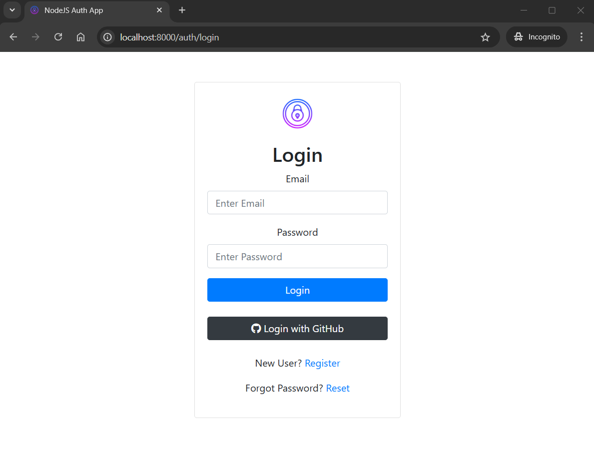
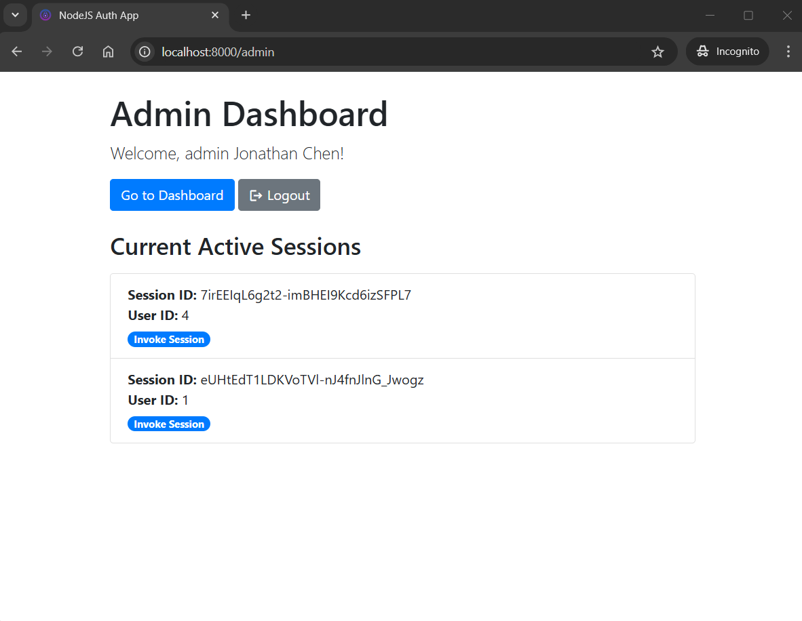

## User Authentication System with GitHub OAuth


## Run Application
Run application in development mode (with nodemon):
```Bash
npm run dev
```
Compile TypeScript files into JavaScript, outputting them to the `dist` folder (as defined in `tsconfig.json`):

```Bash
npm run build
```
Start server in production, executing the compiled JavaScript file:

```Bash
npm run start
```

## Admin Dashboard
Admin is `jonathan123@gmail.com`:

